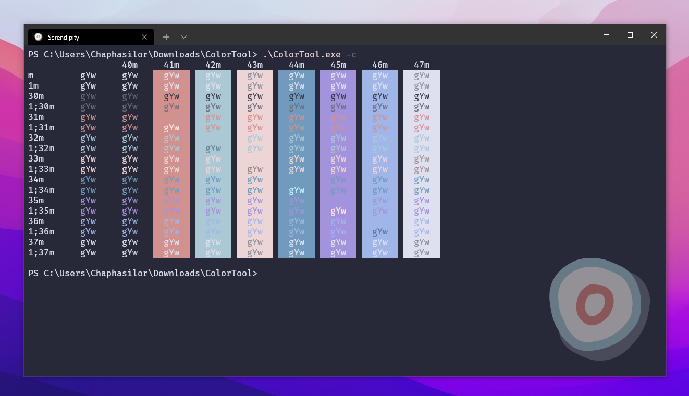
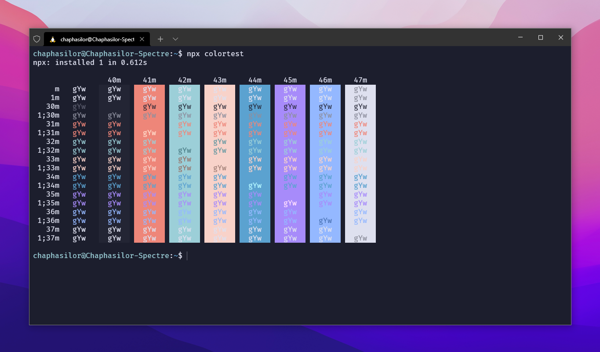
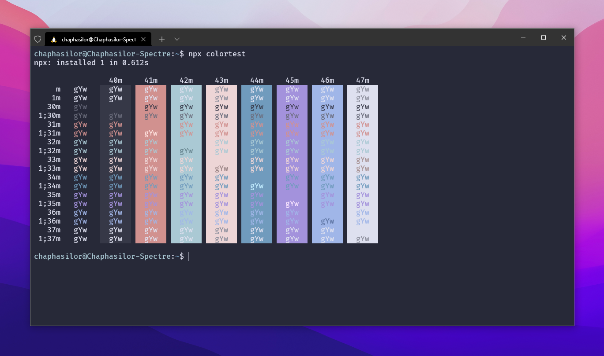
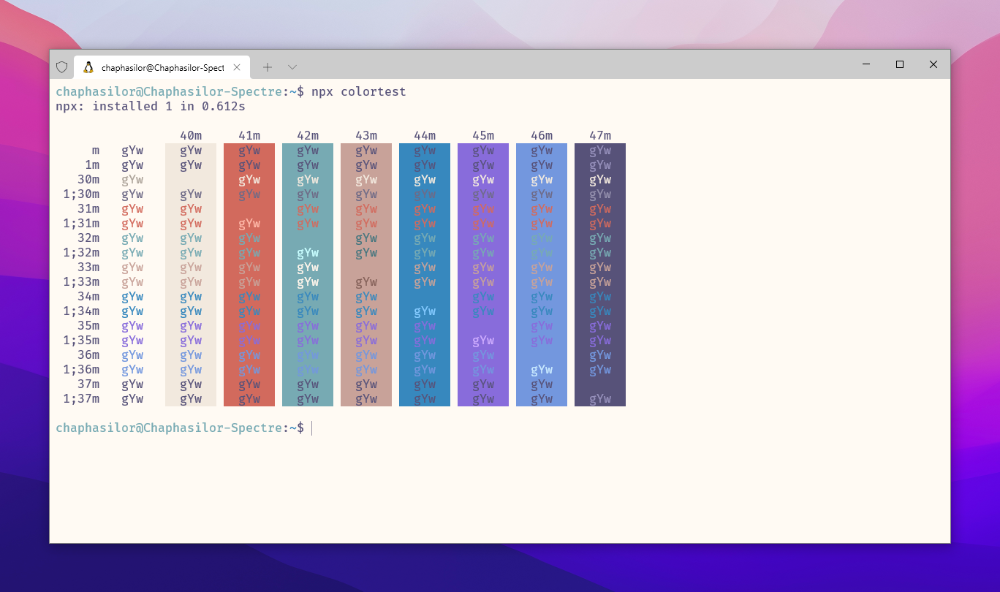

<h1 >Serendipity for Windows Terminal</h1>

This repo contains the Windows Terminal port of Serendipity.

<p align="center">
  
</p>

## Installation

### Automatic Installation (Recommended)

Simply open your Windows Terminal with a PowerShell profile and run the following:

```ps
Invoke-Webrequest -uri 'https://raw.githubusercontent.com/Serendipity-Theme/windows-terminal/main/schemes.jsonc' -OutFile ( New-Item -Path "$($env:LOCALAPPDATA)\Microsoft\Windows Terminal\Fragments\Serendipity\schemes.json" -Force )
```

This will install the lateset version of all three theme variants (Sunset, Midnight and Morning) for the current user.  
The themes will be available in your terminal settings **after restarting your terminal** (close all open instances, then reopen).

You can also add a custom PowerShell profile to use the new themes using this command (requires the Serendipity themes to be already installed):

```ps
Invoke-Webrequest -uri 'https://raw.githubusercontent.com/Serendipity-Theme/windows-terminal/main/profiles.jsonc' -OutFile ( New-Item -Path "$($env:LOCALAPPDATA)\Microsoft\Windows Terminal\Fragments\Serendipity\profiles.json" -Force ) ; Invoke-Webrequest -uri 'https://raw.githubusercontent.com/Serendipity-Theme/windows-terminal/main/serendipity_logo_32px.png' -OutFile ( New-Item -Path "$($env:LOCALAPPDATA)\Microsoft\Windows Terminal\Fragments\Serendipity\serendipity_logo_32px.png" -Force ) ; Invoke-Webrequest -uri 'https://raw.githubusercontent.com/Serendipity-Theme/windows-terminal/main/serendipity_logo_256px.png' -OutFile ( New-Item -Path "$($env:LOCALAPPDATA)\Microsoft\Windows Terminal\Fragments\Serendipity\serendipity_logo_256px.png" -Force )
```

### Manual Installation

Check out the [Windows Terminal Docs](https://docs.microsoft.com/en-us/windows/terminal/custom-terminal-gallery/custom-schemes) to learn how to install custom color schemes.

Here's the gist:

1. Open the [`schemes.jsonc`](https://github.com/Serendipity-Theme/windows-terminal/blob/master/schemes.jsonc) file inside this repository
   - This file is a small part of the Windows Termial Settings file and includes only the three theme variants
2. Copy the three theme variants to the `schemes`-array inside your Windows Terminal settings file (`settings.json`)
   - You can find the file by opening your terminal and pressing `CTRL` + `SHIFT` + `,`

### Tips

- After installing the themes, you'll have to update your profiles in order to use them. Go to settings, choose your profile on the left, click the `Appearance` tab and select the new color scheme.  
  You can also change your "Defaults"-profile in case you haven't overwritten it with your profiles.
- Recent versions of Windows Terminal allow you to choose an "Unfocused Appearance". Using *Serendipity Midnight* as the "normal" scheme and *Serendipity Sunset* as the unfocused theme makes for a nice effect, reducing text contrast whenever your terminal isn't focused.  
  The included PowerShell profile (see [Automatic Installation](#automatic-installation-recommended)) has this enabled by default.

## Theme Variants

<h3 align="center">Serendipity Midnight</h3>

<p align="center">
  
</p>

```json
{
  "name": "Serendipity Midnight",
  "background": "#1C1E2D",
  "foreground": "#DEE0EF",
  "cursorColor": "#6B6D7C",
  "selectionBackground": "#2C2E3D",
  "black": "#232534",
  "brightBlack": "#8D8F9E",
  "blue": "#5BA2D0",
  "brightBlue": "#5BA2D0",
  "cyan": "#94B8FF",
  "brightCyan": "#94B8FF",
  "purple": "#A78BFA",
  "brightPurple": "#A78BFA",
  "white": "#DEE0EF",
  "brightWhite": "#DEE0EF",
  "green": "#9CCFD8",
  "brightGreen": "#9CCFD8",
  "red": "#EE8679",
  "brightRed": "#EE8679",
  "yellow": "#F8D2C9",
  "brightYellow": "#F8D2C9"
}
```

<h3 align="center">Serendipity Sunset</h3>

<p align="center">
  
</p>

```json
{
  "name": "Serendipity Sunset",
  "background": "#272938",
  "foreground": "#DEE0EF",
  "cursorColor": "#8D8F9E",
  "selectionBackground": "#313342",
  "black": "#363847",
  "brightBlack": "#6B6D7C",
  "blue": "#709BBD",
  "brightBlue": "#709BBD",
  "cyan": "#A0B6E8",
  "brightCyan": "#A0B6E8",
  "purple": "#A392DC",
  "brightPurple": "#A392DC",
  "white": "#DEE0EF",
  "brightWhite": "#DEE0EF",
  "green": "#AAC9D4",
  "brightGreen": "#AAC9D4",
  "red": "#D1918F",
  "brightRed": "#D1918F",
  "yellow": "#EDD5D6",
  "brightYellow": "#EDD5D6"
}
```


<h3 align="center">Serendipity Morning</h3>

<p align="center">
  
</p>

```json
{
  "name": "Serendipity Morning",
  "background": "#FFFAF3",
  "foreground": "#575279",
  "cursorColor": "#9893A5",
  "selectionBackground": "#F4EFEA",
  "black": "#F2E9DE",
  "brightBlack": "#6E6A86",
  "blue": "#3788BE",
  "brightBlue": "#3788BE",
  "cyan": "#7397DE",
  "brightCyan": "#7397DE",
  "purple": "#886CDB",
  "brightPurple": "#886CDB",
  "white": "#575279",
  "brightWhite": "#575279",
  "green": "#77AAB3",
  "brightGreen": "#77AAB3",
  "red": "#D26A5D",
  "brightRed": "#D26A5D",
  "yellow": "#C8A299",
  "brightYellow": "#C8A299"
}
```

Serendipity Theme created by [Micheal Andreuzza](https://github.com/michael-andreuzza) and ported by [Chaphasilor](https://github.com/Chaphasilor)
